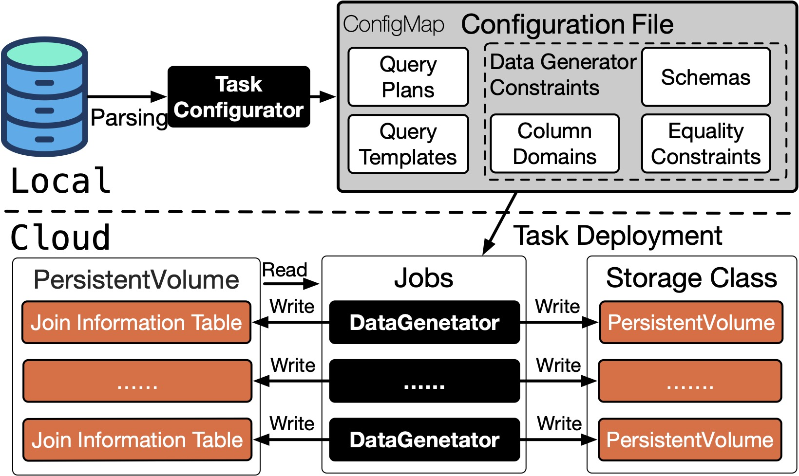

# CTouchstone

**CTouchstone**, a cloud-based query-aware workload generator (SaaS) that can be integrated into almost all cloud vendors through **Kubernetes** (K8s). It is the first work to provide a convenient way to simulate the applications and evaluate the candidate cloud databases. It realizes to collect workload characteristics on application side automatically and deploys the generation task on cloud. Meanwhile, CTouchstone uses a scalable architecture for data generation and shared storage for transferring metadata so as to simulate an application in any data scale on Cloud. In this demo, we will demonstrate the efciency and effectiveness of CTouchstone in application simulation and performance evaluation to cloud databases.

**CTouchstone** is developed by Java. It composes of a lightweight **task congurator (TC)** and a **data generation cluster(DGC)** , which are deployed on application side (Local) and cloud side (Cloud), respectively. 