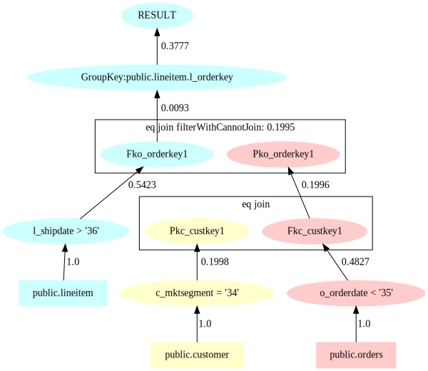

# Mirage使用文档

该文档是对查询感知数据库生成器Mirage的使用说明文档，将介绍Mirage的功能和使用方法。
Mirage是一种新的查询感知数据库生成器，主要功能是通过解析在特定数据库上执行的查询的查询计划，生成仿真查询和仿真数据库，使得在使用相同的查询计划时，在原始数据库上执行原始查询的中间结果和在仿真数据库上执行的仿真查询的中间结果相同（即每个算子的输入输出相同），以达到仿真原始数据库数据分布的目的。

## 使用步骤
Mirage的工作流程分为四个步骤，分别是：查询解析；参数实例化；数据生成；Schema生成，可直接使用给定命令行执行。


### 查询解析
查询解析的主要工作是解析数据库的表列信息，执行原查询以获取查询计划，提取查询模板和获取约束链信息。所有结果存放在配置文件中设定好的解析结果存放目录中。

使用前，请将mirage的版本设置到环境变量中，命令如下。
```bash
export version=0.1.0
```
> **indexScan基数的精确识别:** 由于postgresql的查询计划中，indexScan的rows（即indexScan算子的列）显示为输入的总行数row除以循环数loops，若结果为浮点数，则会取整。
> 如下所示，第一行为原版pg在执行indexScan后查询计划中关于行数的信息，第二行是正确的行数的信息。
```diff
- Index Scan using lineitem_orderkey on lineitem (actual rows=0 loops=157474)
+ Index Scan using lineitem_orderkey on lineitem (actual rows=0.4174 loops=157474)
```
因此，在进行查询解析之前，需要对postgresql中关于explain的源码进行修改，使其显示更精确的行数信息。以pg15为例，只需要修改postgres-REL_15_1/src/backend/commands/explain.c文件即可（修改方法所有版本通用），修改的方法如下：
```diff
--- tmp_postgres-REL_15/postgres-REL_15_1/src/backend/commands/explain.c 2022-11-08 05:36:53.000000000 +0800
+++ postgres-REL_15_1/src/backend/commands/explain.c 2022-11-25 10:43:37.378649399 +0800
@@ -1625,11 +1625,11 @@ ExplainNode(PlanState *planstate, List *
   {
    if (es->timing)
     appendStringInfo(es->str,
-         " (actual time=%.3f..%.3f rows=%.0f loops=%.0f)",
+         " (actual time=%.3f..%.3f rows=%.4f loops=%.0f)",
          startup_ms, total_ms, rows, nloops);
    else
     appendStringInfo(es->str,
-         " (actual rows=%.0f loops=%.0f)",
+         " (actual rows=%.4f loops=%.0f)",
          rows, nloops);
   }
   else
@@ -1641,7 +1641,7 @@ ExplainNode(PlanState *planstate, List *
     ExplainPropertyFloat("Actual Total Time", "ms", total_ms,
           3, es);
    }
-   ExplainPropertyFloat("Actual Rows", NULL, rows, 0, es);
+   ExplainPropertyFloat("Actual Rows", NULL, rows, 4, es);
    ExplainPropertyFloat("Actual Loops", NULL, nloops, 0, es);
   }
  }
@@ -1691,11 +1691,11 @@ ExplainNode(PlanState *planstate, List *
     ExplainIndentText(es);
     if (es->timing)
      appendStringInfo(es->str,
-          "actual time=%.3f..%.3f rows=%.0f loops=%.0f\n",
+          "actual time=%.3f..%.3f rows=%.4f loops=%.0f\n",
           startup_ms, total_ms, rows, nloops);
     else
      appendStringInfo(es->str,
-          "actual rows=%.0f loops=%.0f\n",
+          "actual rows=%.4f loops=%.0f\n",
           rows, nloops);
    }
    else
@@ -1707,7 +1707,7 @@ ExplainNode(PlanState *planstate, List *
      ExplainPropertyFloat("Actual Total Time", "ms",
            total_ms, 3, es);
     }
-    ExplainPropertyFloat("Actual Rows", NULL, rows, 0, es);
+    ExplainPropertyFloat("Actual Rows", NULL, rows, 4, es);
     ExplainPropertyFloat("Actual Loops", NULL, nloops, 0, es);
    }
 
@@ -3422,7 +3422,7 @@ show_instrumentation_count(const char *q
  if (nfiltered > 0 || es->format != EXPLAIN_FORMAT_TEXT)
  {
   if (nloops > 0)
-   ExplainPropertyFloat(qlabel, NULL, nfiltered / nloops, 0, es);
+   ExplainPropertyFloat(qlabel, NULL, nfiltered / nloops, 4, es);
   else
    ExplainPropertyFloat(qlabel, NULL, 0.0, 0, es);
  }
```
修改完成后，就可以进行查询解析了，查询解析的命令行的模板是

```bash
java -jar Mirage-${version}.jar prepare -c config.json -t db_type -l
```

其中`-c`输入的是配置文件，`-t`是数据库的类型（目前，查询解析阶段只支持了POSTGRESQL），而`-l`决定是否复用Schema信息。
> **复用Schema信息:** 由于Mirage使用的解析算法中会解析所有表主外键依赖的拓扑关系，所以解析过程会比较耗时，前文提到的-l参数，就是为了在有表列信息的文件的情况下，可以解析表列信息跳过这一步，使程序不会做重复的工作。

具体地，配置文件config.json的格式包含数据库连接信息和目录信息等信息。
1. `databaseConnectorConfig`: 数据库连接信息. 其是连接目标数据库的连接配置信息
2. `queriesDirectory`: 查询所在目录指的准备进行仿真的查询
3. `resultDirectory`: 执行结果存放目录指的解析出来的数据库信息存放的目录。
4. `defaultSchemaName`: 数据库默认schema名称，这是由于postgresql的特性，必须指定属于的schema，这里填默认的public就好。
示例如下所示.
```json lines
{
  "databaseConnectorConfig": {
    "databaseIp": "127.0.0.1", //数据库IP
    "databaseName": "tpch1", //数据库名字
    "databasePort": "5432", //数据库端口
    "databasePwd": "mima123", //数据库密码
    "databaseUser": "postgres" //数据库用户
  },
  "queriesDirectory": "conf/sql", //查询所在目录
  "resultDirectory": "result", //执行结果存放目录
  "defaultSchemaName": "public" //数据库默认schema名称
}
```
如果不想用设置配置文件的方法，也可以直接用命令行的方法设定配置信息，具体的参数如下所示：
```shell
-D, --database_name=<databaseName> database name
-H, --host=<databaseIp> database ip, default value: 'localhost'
-o, --output=<resultDirectory> the dir path for output
-p, --password database password
-P, --port=<databasePort> database port, default value: '4000'
-q, --query_input=<queriesDirectory> the dir path of queries
-u, --user=<databaseUser> database user name
```

填写好配置信息后，就可以执行查询解析了。


### 参数实例化
参数实例化阶段主要是对匿名化的参数进行实例化，其命令行的格式为
```bash
java -jar Mirage-${version}.jar instantiate -c result
```
其中只需要填写参数-c，即在查询解析阶段的输出目录（上一个阶段的resultDirectory）。执行结束后，输出目录会多出两个文件夹，分别为distribution文件夹和queries文件夹（见收集信息内容）。
其中queries文件夹中是参数实例化后的各个查询，也就是生成的仿真查询，这一过程叫做查询重写。

### 数据生成
数据生成阶段主要是生成每张表的数据，其生成时会使用机器的所有的CPU资源进行生成，生成速度与CPU数量呈线性相关。内存推荐至少为16GB。其命令行的格式为
```bash
java -jar Mirage-${version}.jar generate -c result -o data
```
其中-c指前面提到的解析和实例化的输出结果目录，-o指生成的数据文件的位置。

### Schema生成
为了方便验证生成的仿真查询和仿真数据库的正确性，我们还设计了create命令来生成建表语句，命令行的命令为
```bash
java -jar Mirage-${version}.jar create -c result -d demo -o createSql
```
其中-c指的解析和实例化生成结果的目录，-d指的生成仿真数据库的名字，-o指的建表语句的生成目录。
生成完成后会生成三个文件，分别为建表语句，导入数据的语句和建立索引的语句，执行顺序分别为CreateSchema.sql，importData.sql，CreateIndex.sql。注意：importData.sql里的数据文件路径需要用户自己填写。

生成完数据库后，就可以进行验证了。

## 收集的信息内容
如前文所说，Mirage解析负载得到的收集信息放在了查询解析阶段设置的`resultDirectory`文件夹下，以TPC-H第7个查询为例，解析得到的文件结构如下
```
.
├── column.csv
├── column2IdList
├── queries
│   └── 3_1.sql
├── schema.json
└── workload
    └── 3_1
        ├── 3_1.sql.dot
        ├── 3_1.sql.json
        └── 3_1Template.sql
```
下面分别介绍这些文件的意义

### schema.json
文件是解析得到的数据库表信息，下面以一个例子说明它的结构。


```json
{
  "public.lineitem": {
    "tableSize": 6001215,
    "primaryKeys": "public.lineitem.l_linenumber",
    "canonicalColumnNames": [
      "public.lineitem.l_orderkey",
      "public.lineitem.l_partkey",
      "public.lineitem.l_suppkey",
      "public.lineitem.l_linenumber",
      "public.lineitem.l_quantity",
      "public.lineitem.l_extendedprice",
      "public.lineitem.l_discount",
      "public.lineitem.l_tax"
    ],
    "foreignKeys": {
      "public.lineitem.l_orderkey": "public.orders.o_orderkey",
      "public.lineitem.l_partkey": "public.part.p_partkey",
      "public.lineitem.l_suppkey": "public.supplier.s_suppkey"
    }
  }
}
```

如上面的例子所示，schema.json主要保存了查询涉及到的每张表的表名，表的大小主键信息，外键信息（外键和所依赖的主键）和属性列信息。
### column.csv
中是解析得到的列信息，分别为`columnName`（列名）,`columnType`（数据类型）, `nullPercentage`（空值所占比例）,
`specialValue`（表示值域范围）, `min`（最小值）, `range`（范围）, `originalType`（直接从数据库中获取的原本的数据类型）,
`avgLength`（字符串类型列的平均长度）, `maxLength`（字符串类型列的最大长度）。

### column2IdList
是等值一元基数约束相关的列和它们对应的参数ID，由于Mirage需要对原查询的参数进行匿名化，所以会对每个参数附一个独有的参数ID。一元基数约束的形式为A·Pk，其中A指的是列名，Pk指的是符号化的参数，·指的是符号，包括＝，≠，＜，＞，≤，≥，(NOT)IN，(NOT)LIKE。这个文件的主要作用是在参数实例化的时候进行概率复用。
### Workload文件夹
里是每个查询的查询计划，查询模板，约束链信息。如上面的目录结构所示
其中dot文件是该查询的查询计划，以graphviz的格式呈现，以TPC-H第三个查询为例。



图片为dot格式，查看图片可能需要借助graphviz的渲染插件，可以看见这是该查询执行的树形结构，其中有代表关系表的叶子节点，有选择节点和连接节点。
Json文件中是解析查询得到的约束链信息。
Template.sql文件是提取的查询模板，即将参数匿名化后的原始查询。

## 常见异常及处理方式

### 冲突实参替换
一般来说，大部分的参数实例化都可以由Mirage自动完成，但是由于参数替换的复杂性，这部分的功能并未完全做好，所以一些参数需要手动填写。执行参数实例化的日志会展示有哪些参数替换失败，格式见下面的例子：
未被成功替换的参数如下`[{id:37, data:1.00}, {id:95, data:interval '-340' day}, {id:100, data:-1000.00}, {id:109, data:-1000.00}, {id:129, data:0.12}, {id:133, data:4u9gf47}, {id:134, data:-xjfrez}, {id:135, data:5j98fqm}, {id:136, data:-xjfrez}]`
需要手动填写的信息一般会以注释的形式在queries文件夹中的sql文件的第一行中展示。格式见下面的例子：

```sql
-- cannotFindArgs:{id:129,data:'0.04',operand:public.lineitem.l_discount}
select sum(l_extendedprice * l_discount) as revenue
from lineitem
where l_shipdate >= date '1998-10-14'
  and l_shipdate < date '1998-12-04'
  and l_discount between '0.00' and 0.03 + 0.01
  and l_quantity < '50.03';
```

例子中第一行会展示未填充成功的参数id和原始的参数值，找到日志信息中有相同参数id的参数值，替换上去即可。在这个例子中，第一行的data为0.04，即查询中的0.03+0.01，找到日志中id为129的data为0.12，则将0.03+0.01替换为0.12即可。<br>

### 冲突虚参替换
除此了上述实“参数”（即原查询中存在的的参数）外，还存在一些虚参需要手动填写。虚拟参数是值并不实际存在于原查询，而是Mirage算法会生成的一些用于仿真查询的参数。例如TPCH第21个查询中，有一个where条件是`l1.l_receiptdate > l1.l_commitdate`， Mirage会将它转换为`l1.l_receiptdate - l1.l_commitdate > Parameter`，这里的Parameter就是 虚参。而日志中的{id:95, data:interval '-340'day}就是这个虚参应该填的值，所以这里应该填`l1.l_receiptdate > l1.l_commitdate - 340 day`。另外一种情况的虚参是当查询计划为两个查询树时，一个查询数的输出结果会变成另外一个查询计划里使用的参数，那这个输出结果就会变为虚参，比如TPCH第22个查询。内层循环的查询计划结果作为外层循环的查询条件参数。从queries文件夹中22_1.sql第一行可以看到`cannotFindArgs:{id:109,data:'$0',operand:public.customer.c_acctbal},{id:100,data:'0.0',operand:
public.customer.c_acctbal}`。这里的`$0`就是虚参，在日志中找到对应应该填的参数为`-1000`。TPCH第22个查询中可以看到内存查询的结果被用作外层循环的参数。如下所示

```sql
and c_acctbal > (select avg(c_acctbal)
                            from customer
                            where c_acctbal > 0.00
                              and substring(c_phone from 1 for 2) in
                                  ('11', '13', '12', '28', '19', '20', '24'))
```

这里的填参方法其实是构造c_acctbal > -1000，即运行内部查询得到结果，再使用加法或者乘法是外层大于号右边的数字变为-1000。

## 支持的算子
### 连接
Mirage只能处理PK-FK连接，对于主外键之间的连接，Mirage支持equal join，anti join，outer join，（anti）semi join。

Mirage不支持**外键连接**，**属性列连接**和**自连接**
### 选择

1. 一元选择：Mirage能处理整型数，浮点数，字符，日期的等值（=，≠，in，not in，not like）和不等值算子（>，<，≥，≤).
2. 逻辑谓词：Mirage能处理任意形式的逻辑表达式.
3. 算数谓词：Mirage能处理整型数，浮点数，日期的相同表内任意多列的加减乘除运算。
### 聚合
Mirage支持foreign key上的聚合，并支持sum，count，min，max等算子，但是不支持不在non-key上的聚合。
